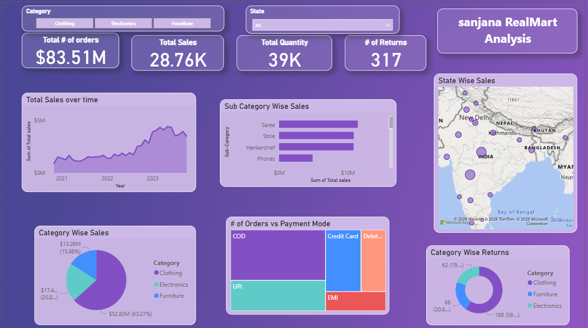

# RealMart Sales Dashboard – Power BI

## 📊 Project Overview
This project showcases an interactive Power BI dashboard built to analyze
retail sales performance using an Excel dataset.

## 🔑 Key Features
- KPI Cards: Total Sales, Orders, Quantity, Returns
- Category and Sub-Category wise analysis
- State-wise sales visualization
- Payment mode analysis
- Interactive slicers

## 🛠 Tools Used
- Power BI
- DAX
- Excel

## 📸 Dashboard Preview

## 📂 Files in this Repository
- Dataset: realmart_sales_data.xlsx
- Dashboard: RealMart_Dashboard.pbix
- Preview Image: dashboard_preview.png
